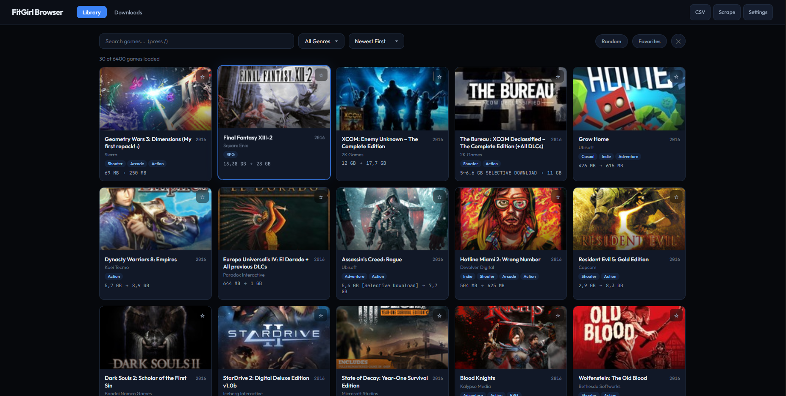
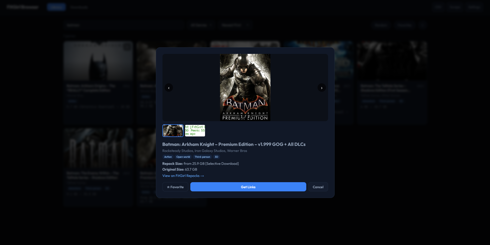
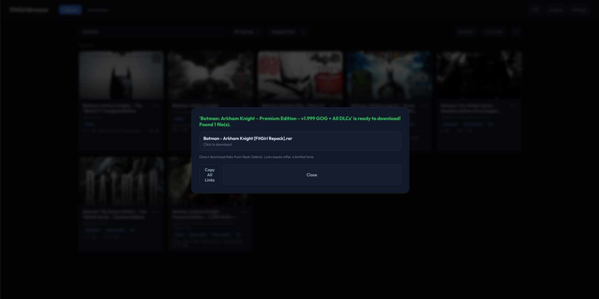

# Repack Browser

A comprehensive self-hosted solution for browsing, downloading, and managing game repacks from multiple sources. Features Real-Debrid integration, system health monitoring, and a Windows client agent for distributed extraction.

> **⚠️ IMPORTANT: Real-Debrid Terms of Service**
>
> This application uses Real-Debrid for downloading. According to [Real-Debrid's Terms of Service](https://real-debrid.com/terms), each account is for **personal use only** and should only be used from **one household/IP address**.
>
> **✅ ALLOWED:** Multiple devices/users in the same household sharing one Real-Debrid account via this app
>
> **❌ NOT ALLOWED:** Sharing this installation publicly or with people outside your household
>
> **Your responsibility:** Comply with Real-Debrid's TOS. Account suspension/termination is possible if violated.

## Self-Hosting

This project is designed for **personal/household use**. You can:
- Run it on your home server for yourself and household members
- Use the multi-user authentication to separate each person's downloads and favorites
- Connect multiple Windows clients from PCs in your home

Do **NOT** expose this publicly or share access with people outside your household.

## Screenshots

### Library View


### Game Details


### Download Links


## Features

### Core Features
- 🎮 **Multi-source scraping** - ~7500+ games from FitGirl Repacks and SteamRIP
- 🔍 **Advanced search** - Search, genre filtering, sorting (date, title, size)
- ⭐ **Favorites system** - Mark and filter your favorite games
- 🎲 **Random picker** - Discover new games randomly
- 🖼️ **Screenshot galleries** - View game screenshots before downloading
- 🔗 **Real-Debrid integration** - Convert magnet links and DDL to direct downloads
- 🎨 **RAWG API integration** - Auto-fill missing game metadata and images

### Multi-User Authentication
- 👥 **User accounts** - Separate login for each household member
- 🔐 **Session-based auth** - Secure authentication with HTTP-only cookies
- 🛡️ **Admin roles** - Admin users can manage the system
- 📂 **Personal data** - Each user has their own favorites and download history
- 🔑 **Default admin** - `admin` / `admin` (change immediately on first login)

### Download Management
- 📥 **Queue system** - Manage multiple downloads
- 📊 **Real-time progress** - Live download speed, ETA, and progress bars
- 📦 **Auto-extraction** - Automatically extract .zip and .7z archives
- ✅ **MD5 validation** - Verify file integrity after extraction
- 🔄 **Retry failed downloads** - Automatic retry with error recovery
- 🗑️ **Smart cleanup** - Optional archive deletion after extraction

### System Health & Installation
- 💻 **System monitoring** - Track RAM, disk space, CPU cores, missing DLLs
- ⚠️ **Pre-install checks** - Validate system requirements before installation
- 🛠️ **Installation assistant** - One-click DLL installation and AV exclusions
- 📝 **Installation logs** - Track success/failure with error analysis
- 📈 **Community ratings** - Share installation difficulty and issues
- 🔍 **Failure analysis** - AI-powered recommendations for failed installations

### Windows Client Agent
- 🖥️ **Distributed extraction** - Offload extraction to Windows clients
- 🌐 **Multi-user support** - Track multiple clients on your network
- 📡 **Real-time reporting** - Live extraction progress from each client
- 🤖 **Auto-watch folders** - Automatically extract files dropped in watch folder
- 🆔 **Client tracking** - Unique UUID per client with system info

## Quick Start

### Docker (Recommended)

1. **Clone the repository:**
```bash
git clone https://github.com/ajgreenboy/repack-browser.git repack-browser
cd repack-browser
```

2. **Copy example config:**
```bash
cp docker-compose.example.yml docker-compose.yml
# Edit docker-compose.yml with your settings
```

3. **Start the server:**
```bash
docker compose up -d --build
```

4. **Access the web UI:**
Open `http://localhost:3030` in your browser.

5. **First login:**
   - You'll be redirected to the login page
   - Use the default admin account: **username:** `admin` **password:** `admin`
   - ⚠️ **IMPORTANT:** Change the admin password immediately after first login!
   - Create additional user accounts for household members via the Register page

6. **Initial setup:**
   - Click **Settings** and add your API keys (optional but recommended)
     - `RD_API_KEY` - Your Real-Debrid API key ([get it here](https://real-debrid.com/apitoken))
     - `RAWG_API_KEY` - RAWG API key for game metadata ([get it here](https://rawg.io/apidocs))
   - Click **Scrape** to populate the database (~5 minutes, ~7500 games)

### Building from Source

Requires Rust 1.85+ and SQLite.

```bash
cargo build --release
./target/release/repack-browser
```

Access at `http://localhost:3000`.

## Windows Client Agent

For distributed extraction and multi-user setups, deploy the Windows client agent on each PC.

### Quick Setup

1. **Download** `client-agent/repack-client.exe` from this repository
2. **Run** the executable - it creates a config file automatically
3. **Configure** `%APPDATA%\RepackClient\config.toml`:
   ```toml
   [server]
   url = "http://your-server-ip:3030"
   enabled = true
   
   [extraction]
   output_dir = "C:\Games"
   watch_dir = "C:\Users\YourName\Downloads"
   ```
4. **Restart** the client

See [client-agent/README.md](client-agent/README.md) for full documentation.

## Security

### ⚠️ Change Default Admin Password

The application creates a default admin account on first run:
- **Username:** `admin`
- **Password:** `admin`

**You MUST change this password immediately:**
1. Log in with the default credentials
2. Create a new admin account with your own credentials
3. (Future update will include password change feature)

### Secret Management

The repository uses proper secret management:
- ✅ `.env` file is gitignored (never committed)
- ✅ `.env.example` provided as template (no real secrets)
- ✅ `docker-compose.override.yml` gitignored (for local config)
- ✅ API keys should be set via environment variables or Settings UI

**Never commit:**
- Real-Debrid API keys
- RAWG API keys
- Database files
- Download directories
- Personal configurations

### Network Security

**For household use:**
- Run behind your home router/firewall
- Don't expose port 3030 to the internet
- Use VPN/Tailscale if accessing remotely from outside your home

**Authentication:**
- Session cookies are HTTP-only and secure
- 30-day session expiry
- Bcrypt password hashing

## Configuration

All configuration can be done through the web UI under **Settings**, or via environment variables.

See [.env.example](.env.example) for all available options.

## Tech Stack

- **Backend:** Rust (Axum framework, SQLite via sqlx)
- **Frontend:** Vanilla JavaScript, custom CSS
- **Scraping:** WordPress REST API, HTML parsing
- **APIs:** Real-Debrid, RAWG
- **Client Agent:** Rust (Windows-specific)

## License

MIT

## Disclaimer

This tool is for educational purposes. Please support game developers by purchasing games legally.
